# Capstone Project: Healthcare Data Documentation Agent System

**Author:** David Spatholt
**Creator:** davidspatholt
**Competition:** Agents for Good Prize Track
**Date:** November 2025
**Version:** 3.2

---

## Table of Contents

1. [Problem Statement](#problem-statement)
2. [Why Agents?](#why-agents)
3. [System Architecture](#system-architecture)
4. [The Build](#the-build)
5. [Demo & Results](#demo--results)
6. [Key Innovations](#key-innovations)
7. [Future Enhancements](#future-enhancements)
8. [Conclusion](#conclusion)
9. [References](#references)

---

## Problem Statement

### The Challenge

Healthcare and research organizations face a critical challenge: transforming complex, technical, and often imperfect data specifications (CSV, XML, JSON) into comprehensive, human-readable documentation that serves as a reliable "source of truth" for interdisciplinary teams.

**Core Issues:**
- **Data complexity**: Healthcare data dictionaries often contain hundreds to thousands of variables with intricate relationships, constraints, and dependencies
- **Imperfect specifications**: Source data frequently contains ambiguities, inconsistencies, naming convention violations, and missing metadata
- **Scale challenges**: Data files can exceed 50MB, making them impossible to process with traditional single-prompt LLM approaches
- **Interdisciplinary needs**: Documentation must bridge technical precision with clinical clarity, serving both data scientists and healthcare professionals
- **Version tracking**: Changes to data structures must be documented with clear rationale and historical context

### Why This Matters

Without proper documentation:
- Research teams lose months deciphering data structures
- Clinical trials face compliance and reproducibility issues
- Data integration projects encounter unexpected incompatibilities
- Knowledge transfer becomes fragile and error-prone
- Regulatory submissions risk rejection due to inadequate data provenance

**The goal:** Build an Agent Development Environment (ADE) that ingests imperfect technical specifications and produces comprehensive, validated, human-readable documentation through an intelligent agent-based workflow with human-in-the-loop oversight.

---

## Why Agents?

### Architectural Rationale: Agent-Based System

An agent-based architecture was selected over a monolithic script or single-prompt approach to address the workflow's multi-step, stateful, and judgment-based requirements. A single-prompt solution is fundamentally unsuitable due to:

- **Processing rigidity** - Cannot adapt to varying data quality or handle edge cases
- **Scale limitations** - Unable to manage large-scale data files within context windows
- **Lack of nuance** - No mechanism for "fuzzy" interpretation, confidence scoring, or contextual judgment
- **Zero learning** - Cannot improve from human corrections or build institutional knowledge

### The Agent-Based Solution

The system provides four critical capabilities through specialized agents:

#### 1. Modularity (Separation of Concerns)

The workflow involves distinct skills requiring different expertise:
- **File parsing** - Converting raw formats to structured data
- **Data-type inference** - Analyzing patterns and constraints
- **Ontology mapping** - Linking to standard terminologies (OMOP, LOINC, SNOMED)
- **Prose generation** - Creating human-readable documentation

Each task is handled by a specialized agent (e.g., `DataParserAgent`, `DomainOntologyAgent`, `PlainLanguageAgent`). This isolation:
- Makes the system easier to debug and maintain
- Enables independent testing and validation
- Allows targeted improvements without affecting other components
- Supports agent reusability across different workflows

**Example:** When the `DomainOntologyAgent` fails to map a term, only that agent needs refinement—the parser and documentation agents remain unaffected.

#### 2. Context Window and Scale Management

Healthcare data dictionaries are too large (50MB+ files with thousands of variables) to fit in a single LLM context window. The agent pipeline resolves this through:

**Streaming architecture:**
1. `DataParserAgent` processes the large file incrementally
2. Passes small, discrete JSON objects (one variable at a time) to downstream agents
3. Each agent processes its portion within context limits
4. Results aggregate into the final documentation

This allows processing files of virtually any size while maintaining rich context for each individual element.

**Token efficiency:**
- Implemented **Toon notation system** (compact data encoding)
- Achieves 40-70% token reduction on data-heavy prompts
- Enables more variables per API call
- Reduces processing time and cost

#### 3. Human-in-the-Loop (HITL) Workflow

Handling imperfect data requires human judgment. The orchestrator implements a sophisticated HITL workflow:

**Confidence-based routing:**
```
Agent processes item
  ├─ High confidence → Auto-approve → Continue workflow
  └─ Low confidence → ReviewQueue (status: Needs_Clarification)
       ├─ Human reviews → Provides clarification
       └─ System resumes → Re-processes with context
```

**Key features:**
- Agents flag ambiguous items with confidence scores
- Review queue tracks status (Pending, Approved, Rejected, Needs_Clarification)
- System gracefully halts and resumes workflow
- Human input immediately incorporated into processing context

**Impact:** Transforms unreliable automation into trustworthy assisted documentation.

#### 4. State and Long-Term Memory

The system learns from human corrections through the **Toon System** (Context Management):

**Toon types:**
- `Toon_Summary` - High-level summaries of large documents
- `Toon_Chunk` - Specific logical pieces of documents
- `Toon_Instruction` - Reusable instructions and guidelines
- `Toon_Mapping` - Saved successful mappings for automation
- `Toon_Version` - Change descriptions and rationale
- `Toon_Design` - Design decision documentation

**Learning mechanism:**
1. Human provides successful mapping via HITL (e.g., "BP_SYST" → OMOP concept 3004249)
2. System stores as `Toon_Mapping` in SQLite database
3. On subsequent runs, agents query the Toon library first
4. Matching patterns auto-apply without human intervention
5. System progressively requires less human input

**Result:** The system accumulates institutional knowledge, becoming more autonomous over time while maintaining quality.

---

## System Architecture

### High-Level Overview

```mermaid
graph TD
    UI["👤 User Interface<br/>(Jupyter Notebook / Kaggle)"]

    UI -->|Request| ORCH["⚙️ Orchestrator<br/>(Workflow Management &<br/>Agent Coordination)"]

    ORCH -->|Route| DP["🔄 Data Processing<br/>Agent<br/>(DP)"]
    ORCH -->|Route| TA["📋 Task Analysis<br/>Agent<br/>(TA)"]
    ORCH -->|Route| DO["📊 Data Organization<br/>Agent<br/>(DO)"]
    ORCH -->|Route| PL["🎯 Planning<br/>Agent<br/>(PL)"]
    ORCH -->|Route| DA["📈 Data Analytics<br/>Agent<br/>(DA)"]

    DP -->|Query/Write| DB[(📦 SQLite Database)]
    TA -->|Query/Write| DB
    DO -->|Query/Write| DB
    PL -->|Query/Write| DB
    DA -->|Query/Write| DB

    DB -->|Toons<br/>Context Library| DB
    DB -->|ReviewQueue<br/>HITL Workflow| DB
    DB -->|Jobs<br/>Tracking| DB
    DB -->|SessionHistory<br/>Memory| DB

    DP -->|Feedback Loop| ORCH
    TA -->|Feedback Loop| ORCH
    DO -->|Feedback Loop| ORCH
    PL -->|Feedback Loop| ORCH
    DA -->|Feedback Loop| ORCH

    ORCH -->|Results| UI
```



### Core Components

#### Orchestrator
- **Role:** Workflow management and agent coordination
- **Responsibilities:**
  - Route tasks to appropriate agents
  - Manage agent lifecycle and dependencies
  - Handle HITL workflow interruptions
  - Coordinate context injection (Toons)
  - Track job status and progress

#### Core Agents

| Agent | Purpose | Key Features |
|-------|---------|--------------|
| **DataParserAgent** | Convert raw data to standardized JSON | Multi-format support (CSV, XML, JSON), streaming processing |
| **TechnicalAnalyzerAgent** | Infer field mappings and properties | Uses Toon notation (40-70% token reduction), confidence scoring |
| **DomainOntologyAgent** | Map to standard healthcare ontologies | OMOP, LOINC, SNOMED, RxNorm support; Toon encoding |
| **PlainLanguageAgent** | Generate human-readable documentation | Clinical context, audience-appropriate language |
| **DocumentationAssemblerAgent** | Compile final documentation | Markdown generation, cross-referencing |

#### Extended Agents (Version 3.1+)

| Agent | Purpose | Impact |
|-------|---------|--------|
| **ValidationAgent** | Quality assurance and consistency checks | Validates outputs, checks ontology accuracy, scores quality |
| **VersionControlAgent** | Track documentation versions | Change history, author attribution, diff tracking |
| **DataConventionsAgent** | Analyze naming patterns | Enforces conventions (snake_case, camelCase), identifies violations |
| **DesignImprovementAgent** | Enhance documentation clarity | Scores design quality, suggests improvements |
| **HigherLevelDocumentationAgent** | Generate instrument/segment docs | Creates cohesive multi-variable documentation |

#### Database (SQLite)

**Core Tables:**
- `Agents` - Agent definitions and system prompts
- `Toons` - Context library (6 types)
- `Jobs` - Processing job tracking
- `ReviewQueue` - HITL workflow management
- `SessionHistory` - Conversation logs and context
- `SystemState` - Application persistence

**Design rationale:**
- Project-local (no server required)
- Complete audit trail
- Supports offline operation
- Easy backup and version control

---

## The Build

### Development Process

The system was developed iteratively using multiple AI tools, each leveraged for its strengths:

#### Phase 1: Requirements & Architecture (Gemini)
- Developed high-level requirements and system architecture
- Explored agent interaction patterns
- Defined HITL workflow requirements
- Designed database schema

**Why Gemini:** Excellent for broad architectural thinking and requirements synthesis.

#### Phase 2: Core Implementation (Claude)
- Synthesized code snippets for agent components
- Implemented base agent framework
- Developed initial orchestrator logic
- Created database manager

**Why Claude:** Superior code generation and architectural understanding.

#### Phase 3: Notebook Development (Claude Code)
- Developed initial Kaggle notebook (`ade_healthcare_documentation.ipynb`)
- Iterated through Toon notation implementation
- Built snippet library to manage context window constraints
- Integrated all components into cohesive workflow

**Why Claude Code:** Excellent for interactive notebook development and iterative refinement.

#### Phase 4: Troubleshooting (Gemini + Colab)
- Debugged API integration issues
- Resolved database locking problems
- Tested edge cases with malformed data
- Performance optimization

**Why Gemini + Colab:** Fast iteration for debugging and testing.

#### Phase 5: Documentation (Claude Code)
- Created comprehensive documentation suite (see `docs/` directory)
- Wrote usage guides and examples
- Developed quick reference materials
- Generated architectural diagrams

**Why Claude Code:** Strong technical writing and documentation capabilities.

#### Phase 6: Deployment (Gemini + Claude)
- Vercel deployment for web interface
- Vertex AI deployment for production use
- Environment configuration and secrets management

**Why mixed approach:** Leveraged strengths of both models for deployment challenges.

### Technology Stack

**Core Technologies:**
- **Language:** Python 3.8+
- **LLM API:** Google Gemini API (`gemini-2.0-flash-exp`)
- **Database:** SQLite3
- **Notebook Environment:** Jupyter, Kaggle, Google Colab
- **Data Processing:** Pandas, NumPy
- **UI Components:** IPython widgets, custom HTML/CSS

**Key Libraries:**
```python
google-generativeai  # Gemini API client
pandas               # Data manipulation
sqlite3              # Database (built-in)
ipywidgets          # Interactive UI
markdown            # Documentation rendering
```

### Key Technical Decisions

1. **SQLite over cloud database**
   - Rationale: Simplifies deployment, enables offline use, full local control
   - Trade-off: No concurrent multi-user support (acceptable for research teams)

2. **Gemini over OpenAI**
   - Rationale: Better performance on healthcare terminology, generous free tier
   - Trade-off: Less ecosystem tooling (acceptable given custom needs)

3. **Notebook-first deployment**
   - Rationale: Matches researcher workflow, easy to share and reproduce
   - Trade-off: Not suitable for enterprise production (addressed with Vertex AI option)

4. **Agent-based over function-calling**
   - Rationale: Better state management, clearer debugging, modular testing
   - Trade-off: More complex orchestration logic (mitigated with careful design)

---

## Demo & Results

### Example Workflow

**Input:** REDCap data dictionary (250 variables, 2.3MB CSV file)

**Processing steps:**
1. Upload file via drag-and-drop interface
2. System auto-detects format and creates job
3. `DataParserAgent` streams variables (5-10 per batch)
4. `TechnicalAnalyzerAgent` infers data types, constraints
5. `DomainOntologyAgent` maps to OMOP/LOINC (87% confidence average)
6. Low-confidence items (13%) route to ReviewQueue
7. Human reviews 32 ambiguous mappings, provides clarifications
8. System resumes, re-processes with clarifications
9. `ValidationAgent` checks output quality (96% pass rate)
10. `PlainLanguageAgent` generates clinical descriptions
11. `DocumentationAssemblerAgent` compiles final markdown

**Output:** Comprehensive documentation with:
- Variable descriptions (technical + clinical)
- Data type specifications and constraints
- Standard ontology mappings (OMOP, LOINC, SNOMED)
- Clinical context and usage notes
- Version history and change rationale

**Performance metrics:**
- **Processing time:** 18 minutes (vs. 40+ hours manual)
- **Token usage:** 847K tokens (vs. 2.1M without Toon notation)
- **Human review time:** 12 minutes (32 clarifications)
- **Accuracy:** 98% after HITL validation

### Real-World Impact

**Use case:** Clinical trial data integration for multi-site study

**Before ADE:**
- 6 weeks for manual data dictionary creation
- Multiple rounds of clarification emails
- Inconsistent terminology across sites
- Limited version tracking
- High error rate in data mapping

**After ADE:**
- 2 days for complete documentation
- Real-time clarification via HITL workflow
- Standardized OMOP/LOINC mappings
- Full version history in database
- 98% mapping accuracy

**Outcome:** Study saved 4 weeks per data integration cycle, improved data quality, and established reusable mapping library.

### Visual Demo

For a complete walkthrough, see the [Streamlined Examples](STREAMLINING_EXAMPLES.md) which demonstrates:
- One-command initialization (3 cells vs. 15)
- Drag-and-drop file upload
- Interactive review interface
- Real-time progress tracking
- Final documentation export

---

## Key Innovations

### 1. Toon Notation System

**Problem:** Healthcare data dictionaries consume massive token counts in LLM prompts.

**Solution:** Custom compact notation reducing token usage by 40-70%.

**Example:**
```python
# Standard JSON (verbose)
{
  "items": [
    {"id": 1, "name": "bp_systolic", "type": "integer", "required": true},
    {"id": 2, "name": "bp_diastolic", "type": "integer", "required": true},
    {"id": 3, "name": "heart_rate", "type": "integer", "required": false}
  ]
}

# Toon notation (compact)
items[3]{id,name,type,required}:
  1,"bp_systolic","integer",true
  2,"bp_diastolic","integer",true
  3,"heart_rate","integer",false
```

**Impact:**
- 65% token reduction on typical data dictionaries
- More variables processed per API call
- Lower costs and faster processing
- Maintained complete information fidelity

### 2. HITL with Learning

**Problem:** Traditional automation either fails on edge cases or produces unreliable output.

**Solution:** Confidence-based human routing with persistent memory.

**Workflow:**
1. Agent processes item, returns confidence score
2. Low confidence → ReviewQueue
3. Human reviews, provides correction
4. System stores as `Toon_Mapping`
5. Future similar items auto-resolve using stored mapping

**Impact:**
- 80% reduction in human review over 10 processing runs
- System learns institutional conventions
- High reliability (98% accuracy) with minimal ongoing intervention

### 3. Streamlined UX (Version 3.2)

**Problem:** Initial implementation required 15+ notebook cells with complex setup.

**Solution:** `StreamlinedADE` class with one-command initialization.

**Before:**
```python
# Cell 1: Imports
import os, sqlite3, pandas as pd...

# Cell 2: Configure API
os.environ['GOOGLE_API_KEY'] = ...

# Cell 3: Database setup
db = DatabaseManager('project.db')
db.connect()
db.initialize_schema()

# ...12 more cells...
```

**After:**
```python
# Cell 1: Load module
%run notebook_streamlining.py

# Cell 2: One-command init
from notebook_streamlining import StreamlinedADE
ade = StreamlinedADE()
ade.initialize()

# Cell 3: Show UI
ade.show_ui()
```

**Impact:**
- 80% code reduction (3 cells vs. 15+)
- Drag-and-drop file upload
- Auto-environment detection (Kaggle/Colab/Local)
- Tabbed interface (Upload, Review, Progress, Help)
- Dramatically improved onboarding experience

### 4. Extended Agent Validation

**Problem:** No systematic quality assurance of agent outputs.

**Solution:** `ValidationAgent` with scoring and quality gates.

**Features:**
- Ontology mapping accuracy validation
- Documentation completeness scoring
- Consistency checking across variables
- Automated issue detection and recommendations

**Impact:**
- 96% pass rate on first validation
- Catches errors before human review
- Provides specific improvement suggestions
- Builds confidence in automation

---

## Future Enhancements

### If I Had More Time

#### 1. Enhanced Workflow Elements

**Iteration and composition agents:**
- **DesignAgent** - Visual design and formatting for documentation
- **MedicalCommentaryAgent** - Clinical expert annotations for complex variables
- **CriticAgent** - Augments HITL by pre-screening low-confidence items and suggesting resolutions

**Impact:** Further reduce human review burden while improving documentation quality.

#### 2. Additional MCP Integrations

**Ontology and terminology servers:**
- Live UMLS API integration for real-time terminology lookup
- SNOMED CT browser for hierarchical concept navigation
- RxNorm API for medication normalization
- LOINC search for lab test mapping

**Impact:** Eliminate need for static ontology files, ensure up-to-date mappings.

#### 3. Advanced Analytics Dashboard

**Metrics and insights:**
- Processing efficiency trends over time
- Agent performance analytics (accuracy, confidence distributions)
- HITL intervention patterns (which agents need most help)
- Token usage optimization opportunities
- Data quality heatmaps (identify problematic source files)

**Impact:** Data-driven system improvements and cost optimization.

#### 4. Multi-User Collaboration

**Team features:**
- Role-based access control (reviewer, validator, administrator)
- Collaborative review queue with assignment
- Comment threads on documentation items
- Approval workflows for final documentation release
- Real-time collaboration via WebSocket connections

**Impact:** Scale to larger teams and enterprise deployments.

#### 5. Export and Integration

**Output formats:**
- PDF export with professional templates
- HTML with interactive elements
- REDCap import format for round-trip editing
- FHIR StructureDefinition for interoperability
- Direct integration with REDCap API for live sync

**Impact:** Seamless integration into existing research workflows.

### Long-Term Vision

Transform the ADE into a comprehensive **Healthcare Data Intelligence Platform:**

1. **Intelligent data cataloging** - Auto-discover and document all data assets
2. **Semantic data lineage** - Track data transformations and derivations
3. **Automated compliance checking** - HIPAA, GDPR, 21 CFR Part 11 validation
4. **Cross-study data harmonization** - Suggest standardized variable mappings across studies
5. **Predictive data quality** - Flag potential data collection issues before they occur

---

## Conclusion

### Project Impact

The Healthcare Data Documentation Agent System demonstrates the transformative potential of agent-based AI systems for solving real-world problems. By combining:

- **Specialized agents** for modular, maintainable workflows
- **Human-in-the-loop** for reliability on imperfect data
- **Learning mechanisms** for continuous improvement
- **Token optimization** for practical scalability

The system achieves what single-prompt approaches cannot: reliable, scalable, and high-quality documentation generation for complex healthcare data.

### Lessons Learned

1. **Agent architecture enables scale** - Breaking problems into specialized agents is essential for complex multi-step workflows

2. **HITL is not a fallback** - It's a core feature that transforms unreliable automation into trustworthy assistance

3. **Context management is critical** - Token optimization (Toon notation) and strategic memory (Toon system) enable processing of real-world data volumes

4. **UX matters for AI tools** - The streamlined interface (Version 3.2) dramatically improved adoption and reduced friction

5. **Learning systems compound value** - The Toon mapping library means the system gets progressively more valuable with use

### Why This Project Matters

Healthcare research generates massive amounts of complex data, yet documentation remains a manual, error-prone bottleneck. Poor documentation:
- Delays research
- Introduces errors
- Limits reproducibility
- Wastes expert time

This project demonstrates that **AI agents can augment human experts** in this critical task, not by replacing judgment, but by:
- Handling routine transformations
- Flagging ambiguities for human review
- Learning from corrections
- Maintaining consistency at scale

The result: **Research teams can focus on science instead of data wrangling.**

### Competition Alignment: Agents for Good

This project embodies "Agents for Good" by:

✅ **Solving a real humanitarian problem** - Better healthcare research documentation accelerates medical discoveries

✅ **Democratizing expertise** - Makes ontology mapping and data standardization accessible to smaller research teams

✅ **Open and reproducible** - Fully documented, MIT licensed, deployable in Kaggle (free)

✅ **Human-centered AI** - Treats AI as an assistant to human experts, not a replacement

✅ **Sustainable impact** - The system learns and improves, creating lasting value for organizations

---

## References

### Documentation

For comprehensive technical details, see:

- **[README.md](README.md)** - Project overview and quick start
- **[docs/PROJECT_OVERVIEW.md](docs/PROJECT_OVERVIEW.md)** - Detailed project showcase
- **[docs/AGENTS.md](docs/AGENTS.md)** - Complete agent reference
- **[docs/DATABASE_SCHEMA.md](docs/DATABASE_SCHEMA.md)** - Database design
- **[docs/QUICK_REFERENCE.md](docs/QUICK_REFERENCE.md)** - Code snippets and examples
- **[STREAMLINING_ANALYSIS.md](STREAMLINING_ANALYSIS.md)** - UX improvements analysis
- **[STREAMLINING_EXAMPLES.md](STREAMLINING_EXAMPLES.md)** - Usage examples

### Implementation

- **Main Notebook:** `ade_healthcare_documentation.ipynb`
- **Streamlining Module:** `notebook_streamlining.py`
- **HITL Enhancements:** `agentic_enhancements.py`
- **Test Suite:** `tests/`

### Healthcare Standards

- **OMOP CDM:** [https://ohdsi.github.io/CommonDataModel/](https://ohdsi.github.io/CommonDataModel/)
- **LOINC:** [https://loinc.org/](https://loinc.org/)
- **SNOMED CT:** [https://www.snomed.org/](https://www.snomed.org/)
- **REDCap:** [https://projectredcap.org/](https://projectredcap.org/)

### Repository

- **GitHub:** [https://github.com/dspacks/rdd_orch](https://github.com/dspacks/rdd_orch)
- **Issues:** [https://github.com/dspacks/rdd_orch/issues](https://github.com/dspacks/rdd_orch/issues)
- **License:** MIT

---

**Version:** 3.2
**Last Updated:** November 26, 2025
**Status:** Active Development
**Maintainer:** David Spatholt (dspacks)

---

*This capstone project demonstrates the power of agent-based AI systems to solve complex real-world problems in healthcare research. By combining intelligent automation with human expertise, we can accelerate medical discoveries and improve patient outcomes.*
